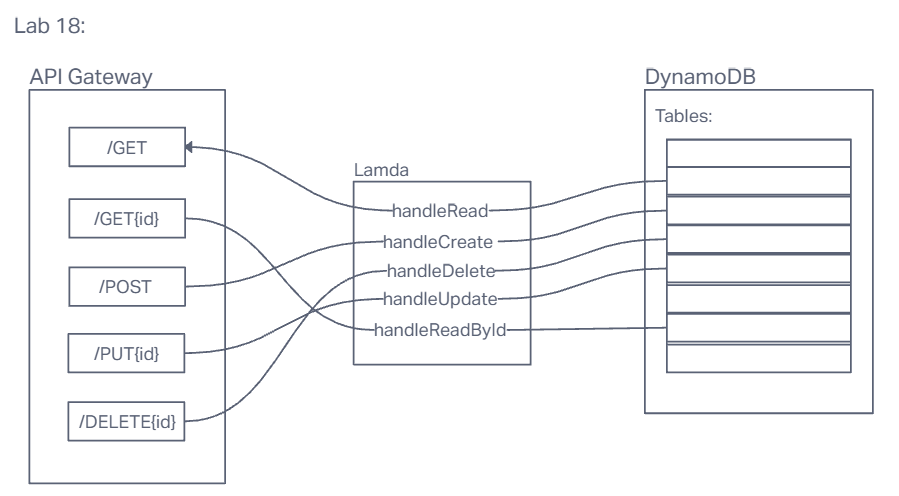

# LAB - Class 18

## Project: AWS: API, Dynamo and Lambda

### Author: Emmanuel Gonzales

Create a single resource REST API using a domain model of your choosing, constructed using AWS Cloud Services.

### Links and Resources

- [GitHub Actions ci/cd](https://github.com/rkgallaway/server-deployment-practice-d51/actions) 
- [back-end server url](http://xyz.com) (when applicable)
- [front-end application](http://xyz.com) (when applicable)

### Collaborators

### Setup

#### `.env` requirements (where applicable)

for now I have none and do not require one

#### How to initialize/run your application (where applicable)

- `npm start`

#### How to use your library (where applicable)

#### Features / Routes

- GET : `/person` - Returns all items in the DynamoDB table
- POST : `/person` - Create an item, takes the id, returns the item you created
- GET : `/person{id}` - Get one specific item in the DynamoDB table, input the id and get the person object you want
- PUT : `/person{id}` - Change the values of the object, takes the person id, returns the updated object,
- DELETE : `/person{id}` - Delete an object, input the id of the person you want to delete, return an empty object.

#### UML

